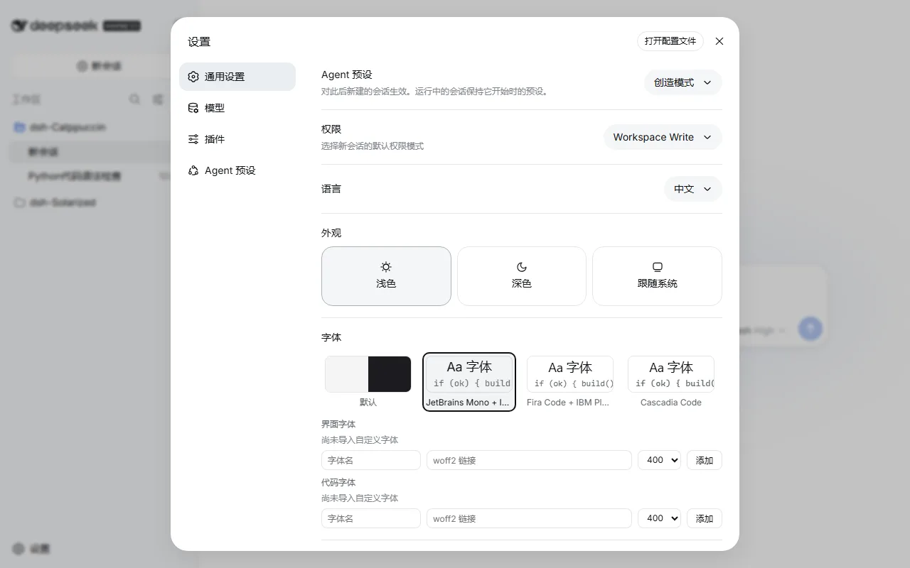
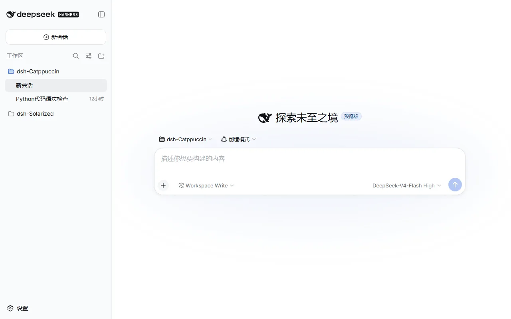

<div align="center">

# dsh-Fonts

**A font system plugin for DeepSeek Harness** — bundled OFL webfonts served offline, user-imported custom fonts, and a `ctx.fonts` registry other plugins can extend

[](https://github.com/zhijun-dai/dsh-Fonts/stargazers)
[](https://github.com/zhijun-dai/dsh-Fonts/issues)
[](https://github.com/zhijun-dai/dsh-Fonts/graphs/contributors)
[](./LICENSE)

English | [中文](./README.md)

</div>

## Overview

DeepSeek Harness's web UI ships with system font stacks and no webfonts. dsh-Fonts turns fonts into a composable resource:

- **Bundled presets**: JetBrains Mono + Inter, Fira Code + IBM Plex Sans, and Cascadia Code pairings, all OFL-licensed and shipped with the plugin for offline use (no CORS issues)
- **Custom import**: enter a family name + woff2 URL in the settings panel to import your own UI/code fonts; the selection persists locally
- **Plugin API**: a `ctx.fonts` registry service — other plugins can register or consume font presets via `ctx.get("fonts")`

## Previews

<details>
<summary>Settings → General → Font (click to expand)</summary>



</details>

<details>
<summary>JetBrains Mono + Inter applied</summary>



</details>

## Usage

A dual-face DSH plugin: the host half serves the bundled font files, the browser half provides the registry and the settings row. After installation, pick fonts in **Settings → General → Font**.

**Install:**

```sh
# GitHub
dsh plugin --profile web add github:zhijun-dai/dsh-Fonts

# local directory (the profile dir is a pnpm workspace root — -w is required)
dsh plugin --profile web add -w /path/to/dsh-Fonts

# npm
dsh plugin --profile web add dsh-fonts
```

Then restart `dsh web`.

**Switching fonts:** Settings → General → Font row — preset cards apply live; "Default" restores the system stacks.

**Importing custom fonts:** fill in the editor fields (UI font / Code font) and hit Add:

| Field | Meaning |
| --- | --- |
| Family | Any name used to reference the font in the stack (e.g. `Inter`) |
| woff2 URL | An http(s) direct link to the font file; it must be CORS-accessible (CDNs usually are) |
| Weight | 400 Regular · 500 Medium · 600 Semibold · 700 Bold — **pick the weight your file actually is**. Download pages usually label it: Regular=400, Bold=700. A wrong pick won't break anything, the UI just shows a browser-synthesized "fake bold" |

Example — importing Inter Regular from the Fontsource CDN as the UI font:

```
Family: Inter
woff2 URL: https://cdn.jsdelivr.net/npm/@fontsource/inter@5.3.0/files/inter-latin-400-normal.woff2
Weight: 400 Regular
```

It applies immediately and survives reloads; re-adding the same family+weight replaces the old entry, and Remove deletes it.

## Plugin API

Other plugins consume the font service lazily via `ctx.get("fonts")` (cross-plugin `require` is a build error — module imports cannot be used):

```ts
// in your plugin's browser half
import type { FontPreset, FontRegistry } from 'dsh-fonts/client'

// register your own font preset
const dispose = ctx.get('fonts')?.register({
  id: 'my-preset',
  ui: ['My Font', '-apple-system', 'sans-serif'],
  code: ['My Mono', 'monospace'],
  faces: [{ family: 'My Font', weight: '400', src: ['https://example.com/my-font.woff2'] }],
})

// subscribe to snapshots
const off = ctx.get('fonts')?.subscribe((snapshot) => {
  console.log(snapshot.activeId, snapshot.revision)
})
```

Full `FontPreset` / `FontSnapshot` / `FontRegistry` types live in `lib/types/client/index.d.ts`.

## How it works

- The browser half provides the registry to the root context via `ctx.provide("fonts", registry)` at `apply` time
- On selection changes it rewrites an injected `<style id="dsh-fonts">`: `@font-face` rules plus `:root` overrides of `--dsw-font-family` / `--ds-font-family-code` — the two CSS variables every DSH component consumes via `var()` (defined in `@deepseek-ai/dsh-client-ui-theme`'s `base.css`)
- The host half registers a `/plugins/dsh-fonts/fonts/*` route on `ctx.webServer`, serving the woff2 files bundled under `data/fonts/`
- The selection persists in `localStorage` (`dsh-fonts:prefs`) and is restored at boot; a selected plugin-registered preset falls back to the default if that plugin is absent

## Known limitations

- Some components hardcode an `Inter, var(--dsw-font-family)` stack (e.g. the workspace browser) — those keep Inter on systems that have it installed
- Bundled fonts are latin subsets (~280KB total); CJK text falls back through the stack tail to system fonts (PingFang SC / Microsoft YaHei)
- Custom imports accept woff2 URLs only (http/https)

## Font credits

Bundled fonts are licensed under the SIL Open Font License 1.1; license texts ship in `data/fonts/LICENSE-*.txt`:

- [JetBrains Mono](https://github.com/JetBrains/JetBrainsMono) — JetBrains s.r.o.
- [Inter](https://github.com/rsms/inter) — Rasmus Andersson
- [Fira Code](https://github.com/tonsky/FiraCode) — The Fira Code Project Authors
- [IBM Plex Sans](https://github.com/IBM/plex) — IBM Corp.
- [Cascadia Code](https://github.com/microsoft/cascadia-code) — Microsoft

## 💝 Thanks

- [DeepSeek Harness](https://github.com/deepseek-ai/deepseek-harness) — the plugin architecture and the `dsh.client` dual-face mechanism
- [Fontsource](https://fontsource.org) — webfont distribution
- [dsh-Catppuccin](https://github.com/zhijun-dai/Catppuccin-dsh-theme) / [dsh-Solarized](https://github.com/zhijun-dai/Solarized-dsh-theme) — the repository conventions this plugin follows

<div align="center">

**dsh-Fonts** · Copyright 2026-present [zhijun-dai](https://github.com/zhijun-dai) · [MIT License](./LICENSE)

</div>
